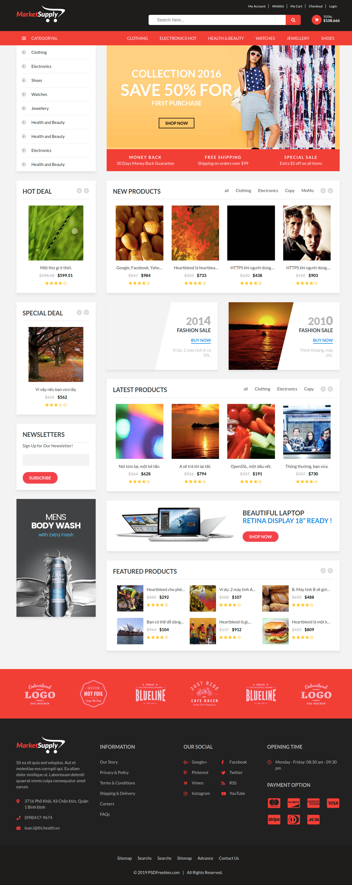
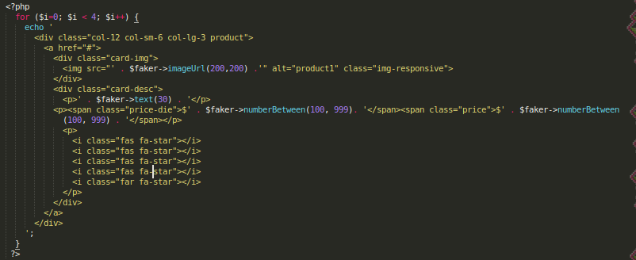
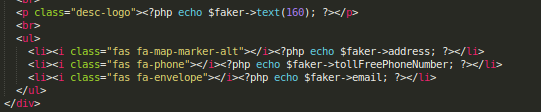
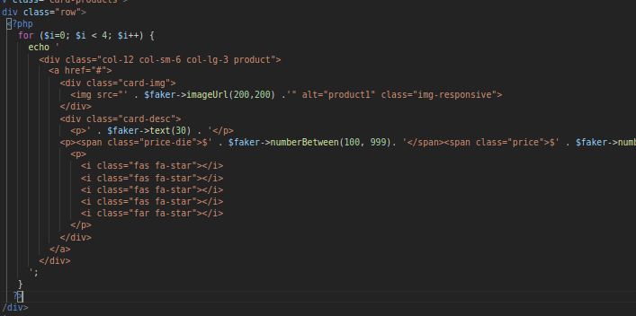

# Bài tập Trainee Colombo 2019

## PHP Basic

- Sử dụng webstack hoặc sử dụng chế độ server để tạo 1 project serv

- Thực hiện bởi: [Nguyễn Gia Hào](https://github.com/AIV-T-STARK)

### Update:
- sử dụng package [Faker](https://github.com/fzaninotto/Faker) để gen dữ liệu.

### Cài đặt:
- clone về và chạy composer install
- chạy trên host
